<p align="center">
  <picture>
    <source media="(prefers-color-scheme: dark)" srcset="docs/logo/dark.png" />
    <source media="(prefers-color-scheme: light)" srcset="docs/logo/light.png" />
    
  </picture>
</p>

<p align="center">
<a href="https://github.com/MervinPraison/PraisonAI"></a>
<a href="https://github.com/MervinPraison/PraisonAI"></a>
<a href="https://github.com/MervinPraison/PraisonAI"></a>
</p>

<div align="center">

# Praison AI

<a href="https://trendshift.io/repositories/9130" target="_blank"></a>

</div>

PraisonAI is a production-ready Multi-AI Agents framework with self-reflection, designed to create AI Agents to automate and solve problems ranging from simple tasks to complex challenges. By integrating PraisonAI Agents, AutoGen, and CrewAI into a low-code solution, it streamlines the building and management of multi-agent LLM systems, emphasising simplicity, customisation, and effective human-agent collaboration.

<div align="center">
  <a href="https://docs.praison.ai">
    <p align="center">
      
    </p>
  </a>
</div>

## Key Features

- 🤖 Automated AI Agents Creation
- 🔄 Self Reflection AI Agents
- 🧠 Reasoning AI Agents
- 👁️ Multi Modal AI Agents
- 🤝 Multi Agent Collaboration
- 🎭 AI Agent Workflow
- 📚 Add Custom Knowledge
- 🧠 Agents with Short and Long Term Memory
- 📄 Chat with PDF Agents
- 💻 Code Interpreter Agents
- 📚 RAG Agents
- 🤔 Async & Parallel Processing
- 🔄 Auto Agents
- 🔢 Math Agents
- 🎯 Structured Output Agents
- 🔗 LangChain Integrated Agents
- 📞 Callback Agents
- 🤏 Mini AI Agents
- 🛠️ 100+ Custom Tools
- 📄 YAML Configuration
- 💯 100+ LLM Support

## Project Structure

PraisonAI follows a modular architecture designed for scalability and flexibility:

```
PraisonAI/
├── backend/              # Core backend services
│   └── api.py            # Main FastAPI application
├── praisonai/            # Core framework
│   ├── workflow_planner.py # Workflow planning engine
│   └── agents_generator.py # Agent generation logic
├── ui/                   # Real-time monitoring interface
│   ├── realtime.py       # Real-time execution monitoring
│   ├── db.py            # Database operations
│   └── components/      # UI components
├── config.yaml           # Main configuration
├── agents.yaml           # Agent configurations
├── docker/               # Containerization
├── docs/                 # Documentation
└── examples/             # Usage examples
```

Key Components:
- **[Workflow Planner](praisonai/workflow_planner.py)** - Core logic for planning agent workflows
- **[Agents Generator](praisonai/agents_generator.py)** - Creates and manages agent instances
- **[Realtime Monitoring](ui/realtime.py)** - Tracks execution with:
  - SQLite persistence for state tracking
  - Chainlit integration for visual monitoring
  - Event handlers for conversation updates
- **[API Endpoints](backend/api.py)** - REST interface for managing workflows
- **[Configuration](config.yaml)** - Centralized project configuration

## Using Python Code

### Research Analyst Agent
```python
from praisonai import PraisonAI

agent = PraisonAI(
    agents_config="docs/agents/research-analyst.mdx",
    framework="praisonai"
)

result = agent.start({
    "urls": ["https://example.com"],
    "topic": "Your research topic"
})
```

### Key Features:
- Web scraping with CSS selector support
- AI-powered text analysis via OpenRouter
- Persistent result storage in Supabase
- Built-in error handling and retries
- Complete test coverage (pytest)
- Example implementation (examples/research_analyst_demo.py)

### Requirements:
```bash
pip install beautifulsoup4 requests openai supabase python-dotenv pytest
```

Light weight package dedicated for coding:
```bash
pip install praisonaiagents
```

```bash
export OPENAI_API_KEY=xxxxxxxxxxxxxxxxxxxxxx
```

### 1. Single Agent

Create app.py file and add the code below:
```python
from praisonaiagents import Agent
agent = Agent(instructions="Your are a helpful AI assistant")
agent.start("Write a movie script about a robot in Mars")
```

Run:
```bash
python app.py
```

### 2. Multi Agents

Create app.py file and add the code below:
```python
from praisonaiagents import Agent, PraisonAIAgents

research_agent = Agent(instructions="Research about AI")
summarise_agent = Agent(instructions="Summarise research agent's findings")
agents = PraisonAIAgents(agents=[research_agent, summarise_agent])
agents.start()
```

Run:
```bash
python app.py
```

## Using No Code

### Auto Mode:
```bash
pip install praisonai
export OPENAI_API_KEY=xxxxxxxxxxxxxxxxxxxxxx
praisonai --auto create a movie script about Robots in Mars
```

## Using JavaScript Code

```bash
npm install praisonai
export OPENAI_API_KEY=xxxxxxxxxxxxxxxxxxxxxx
```

```javascript
const { Agent } = require('praisonai');
const agent = new Agent({ instructions: 'You are a helpful AI assistant' });
agent.start('Write a movie script about a robot in Mars');
```


## AI Agents Flow

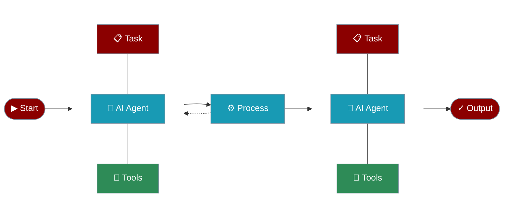

## AI Agents with Tools

Create AI agents that can use tools to interact with external systems and perform actions.

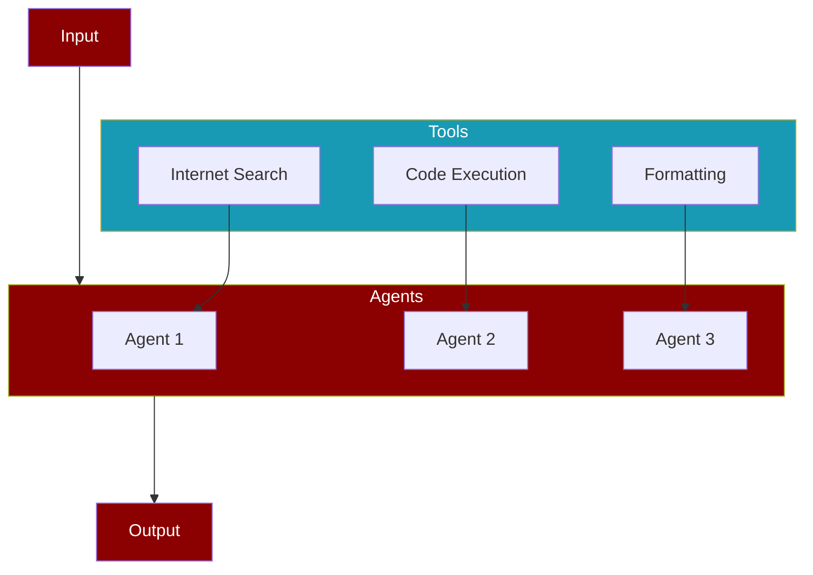

## AI Agents with Memory

Create AI agents with memory capabilities for maintaining context and information across tasks.

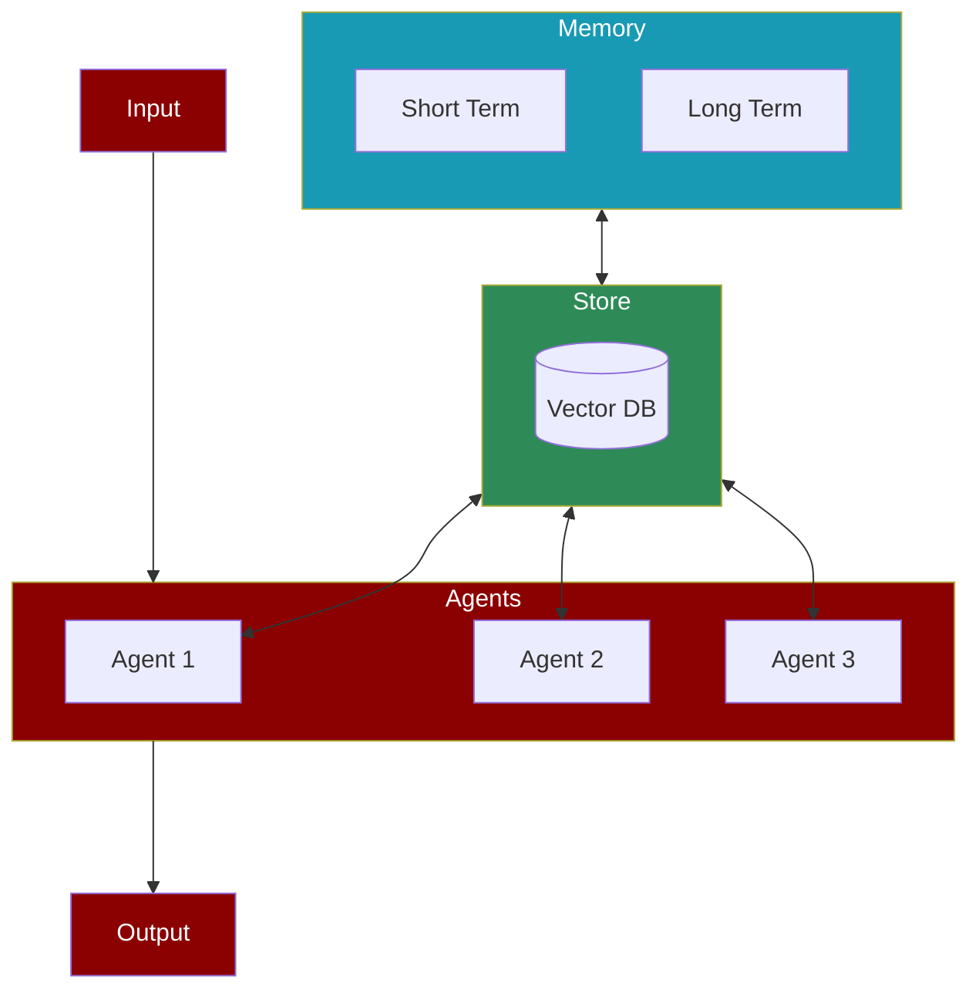

## AI Agents with Different Processes

### Sequential Process

The simplest form of task execution where tasks are performed one after another.

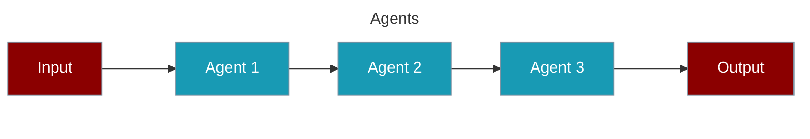

### Hierarchical Process

Uses a manager agent to coordinate task execution and agent assignments.

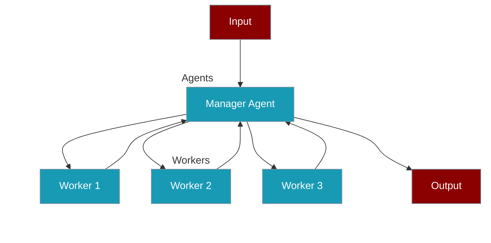

### Workflow Process

Advanced process type supporting complex task relationships and conditional execution.

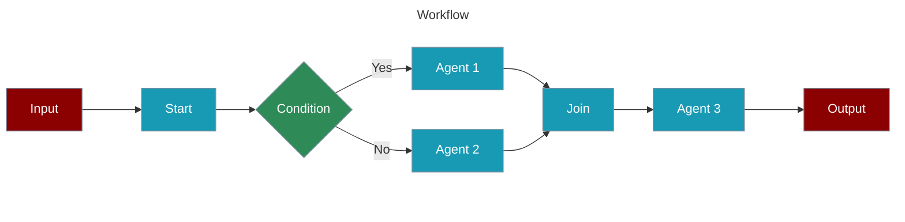

#### Agentic Routing Workflow

Create AI agents that can dynamically route tasks to specialized LLM instances.

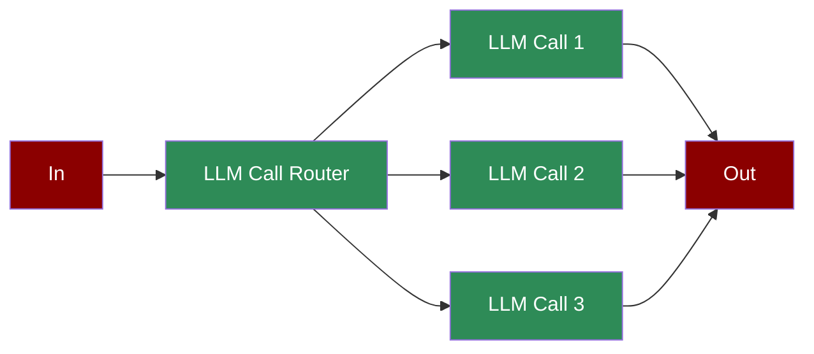

#### Agentic Orchestrator Worker

Create AI agents that orchestrate and distribute tasks among specialized workers.

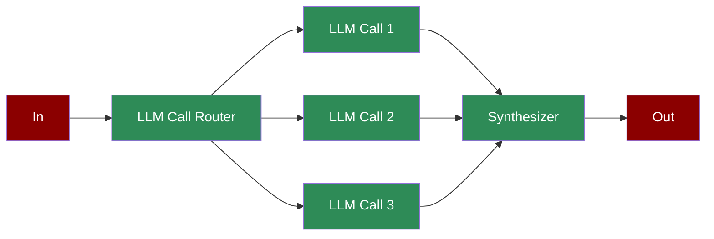

#### Agentic Autonomous Workflow

Create AI agents that can autonomously monitor, act, and adapt based on environment feedback.

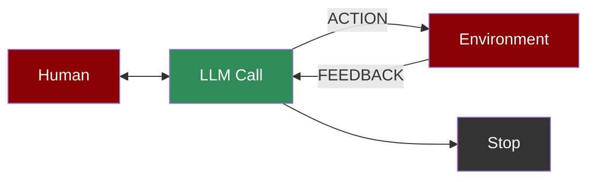

#### Agentic Parallelization

Create AI agents that can execute tasks in parallel for improved performance.

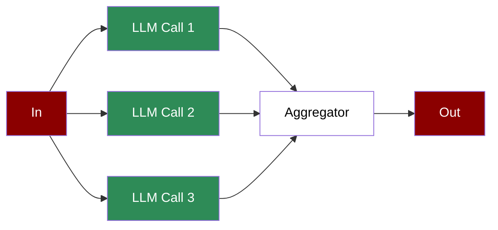

#### Agentic Prompt Chaining

Create AI agents with sequential prompt chaining for complex workflows.

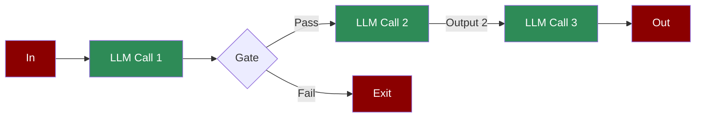

#### Agentic Evaluator Optimizer

Create AI agents that can generate and optimize solutions through iterative feedback.

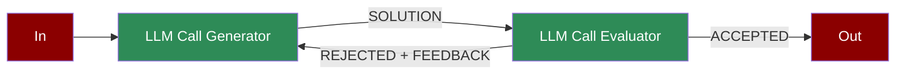

#### Repetitive Agents

Create AI agents that can efficiently handle repetitive tasks through automated loops.

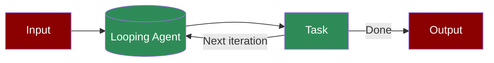

## Adding Models

<div align="center">
  <a href="https://docs.praison.ai/models">
    <p align="center">
      
    </p>
  </a>
</div>

## Ollama Integration
```bash
export OPENAI_BASE_URL=http://localhost:11434/v1
```

## Groq Integration
Replace xxxx with Groq API KEY:
```bash
export OPENAI_API_KEY=xxxxxxxxxxx
export OPENAI_BASE_URL=https://api.groq.com/openai/v1
```

## No Code Options

## Agents Playbook

### Simple Playbook Example

Create `agents.yaml` file and add the code below:

```yaml
framework: praisonai
topic: Artificial Intelligence
roles:
  screenwriter:
    backstory: "Skilled in crafting scripts with engaging dialogue about {topic}."
    goal: Create scripts from concepts.
    role: Screenwriter
    tasks:
      scriptwriting_task:
        description: "Write a script about {topic}"
        expected_output: "Complete script with dialogue"
```

<Note>
You can automatically create `agents.yaml` file using
```bash
praisonai --init "your task description"
```
</Note>

## Use 100+ Models

PraisonAI supports all major LLM providers:
- OpenAI (GPT-4, GPT-3.5)
- Anthropic (Claude)
- Google (Gemini)
- Groq (Llama, Mixtral)
- Ollama (local models)
- And many more...

See full list in [Models Documentation](https://docs.praison.ai/models)

## Development:

```bash
git clone https://github.com/MervinPraison/PraisonAI.git
cd PraisonAI
pip install -e .
```

# Install with extras

```bash
pip install "praisonai[ui,crewai,autogen]"
```

## Contributing

We welcome contributions! Please see our [Contributing Guide](https://docs.praison.ai/contributing) for details.

## Other Features

- **Self Reflection**: Agents can evaluate and improve their own outputs
- **Multi-Modal**: Support for text, image, and audio processing
- **Custom Tools**: Easily add your own tools and integrations
- **Workflow Visualization**: Built-in visualization of agent workflows

## Star History

[](https://star-history.com/#MervinPraison/PraisonAI&Date)

## Video Tutorials

Coming soon! Check our [YouTube channel](https://youtube.com/@praisonai) for updates.
